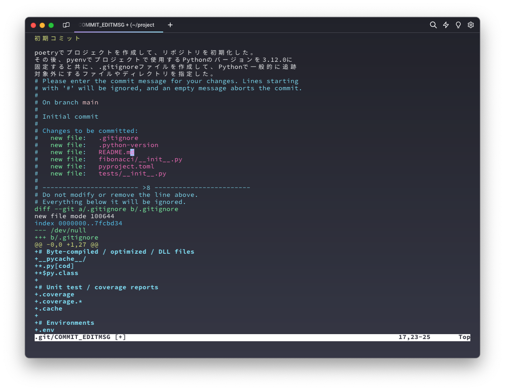
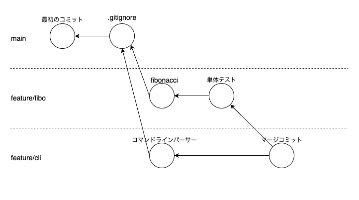
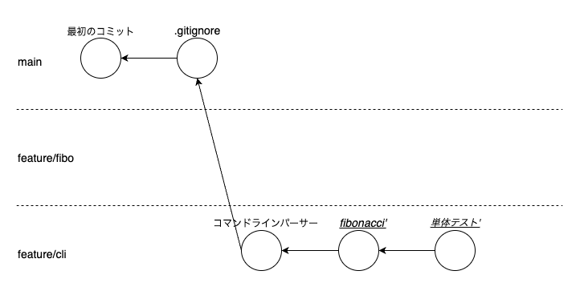

# Gitの概要

- [Gitの概要](#gitの概要)
  - [Gitとは](#gitとは)
  - [Gitのインストール](#gitのインストール)
  - [Gitの設定](#gitの設定)
  - [Gitコマンドのヘルプ表示](#gitコマンドのヘルプ表示)
  - [Gitの3つのエリア](#gitの3つのエリア)
  - [ファイルのライフサイクル](#ファイルのライフサイクル)
  - [ローカルリポジトリの作成](#ローカルリポジトリの作成)
    - [新規にローカルリポジトリを作成する場合](#新規にローカルリポジトリを作成する場合)
    - [既存のリモートリポジトリをローカルリポジトリに複製（クローン）する場合](#既存のリモートリポジトリをローカルリポジトリに複製クローンする場合)
  - [追跡対象外設定](#追跡対象外設定)
  - [Gitの基本](#gitの基本)
    - [プロジェクトの作成](#プロジェクトの作成)
    - [リポジトリ作成後の変更状態の確認](#リポジトリ作成後の変更状態の確認)
    - [リポジトリの状態の確認と最初のコミット](#リポジトリの状態の確認と最初のコミット)
      - [コミットメッセージの入力](#コミットメッセージの入力)
    - [フィボナッチ関数の実装とコミット](#フィボナッチ関数の実装とコミット)
    - [フィボナッチ関数の単体テストの実装とコミット](#フィボナッチ関数の単体テストの実装とコミット)
    - [フィボナッチ数をキャッシュして同じ項のフィボナッチ数を計算しないように改善](#フィボナッチ数をキャッシュして同じ項のフィボナッチ数を計算しないように改善)
    - [変更履歴の確認](#変更履歴の確認)
  - [リポジトリを操作するコマンド](#リポジトリを操作するコマンド)
    - [ローカルリポジトリの作成](#ローカルリポジトリの作成-1)
    - [リモートリポジトリのクローン](#リモートリポジトリのクローン)
  - [Gitの基本的なコマンド](#gitの基本的なコマンド)
    - [ブランチを操作するコマンド](#ブランチを操作するコマンド)
      - [ブランチの一覧と現在のブランチの確認](#ブランチの一覧と現在のブランチの確認)
      - [ブランチの切り替え](#ブランチの切り替え)
      - [ブランチを作成して現在のブランチを作成したブランチに切り替え](#ブランチを作成して現在のブランチを作成したブランチに切り替え)
      - [ブランチ名の変更](#ブランチ名の変更)
      - [ブランチの削除](#ブランチの削除)
      - [現在のブランチにマージされているブランチを表示](#現在のブランチにマージされているブランチを表示)
    - [ファイルのライフサイクルを操作するコマンド](#ファイルのライフサイクルを操作するコマンド)
      - [ファイルをステージングする](#ファイルをステージングする)
      - [ステージングしたファイルをワークツリーに戻す（ステージングの解除）](#ステージングしたファイルをワークツリーに戻すステージングの解除)
      - [ワークツリーでファイルに対する変更を取り消す](#ワークツリーでファイルに対する変更を取り消す)
      - [ワークツリーの変更をすべて取り消す](#ワークツリーの変更をすべて取り消す)
      - [ローカルリポジトリにコミットする](#ローカルリポジトリにコミットする)
      - [リポジトリの状態を表示する](#リポジトリの状態を表示する)
      - [他のブランチを現在のブランチにマージする](#他のブランチを現在のブランチにマージする)
      - [リポジトリの変更を退避する](#リポジトリの変更を退避する)
    - [コミット履歴を参照するコマンド](#コミット履歴を参照するコマンド)
      - [コミット履歴を確認する](#コミット履歴を確認する)
      - [リポジトリの内容を過去のコミットに戻す](#リポジトリの内容を過去のコミットに戻す)
        - [ブランチの最新のコミットに戻す](#ブランチの最新のコミットに戻す)
        - [過去のコミットからブランチを作成して作業する](#過去のコミットからブランチを作成して作業する)
  - [コンフリクトの解消](#コンフリクトの解消)
  - [ブランチ戦略 - git-flow](#ブランチ戦略---git-flow)
  - [リモートリポジトリ](#リモートリポジトリ)
    - [リモートリポジトリの作成](#リモートリポジトリの作成)
    - [リモートリポジトリとローカルリポジトリの紐付け](#リモートリポジトリとローカルリポジトリの紐付け)
    - [リモートリポジトリの内容をフェッチ（取得）](#リモートリポジトリの内容をフェッチ取得)
    - [リモートリポジトリの内容をマージ](#リモートリポジトリの内容をマージ)
    - [リモートリポジトリにローカルリポジトリの内容をプッシュ](#リモートリポジトリにローカルリポジトリの内容をプッシュ)
    - [リモートリポジトリのブランチを削除](#リモートリポジトリのブランチを削除)
    - [リモートリポジトリとの紐付けを削除](#リモートリポジトリとの紐付けを削除)
  - [過去のコミットの修正 - コミット履歴の書き換え](#過去のコミットの修正---コミット履歴の書き換え)
    - [注意事項](#注意事項)
      - [リモートリポジトリにプッシュしたコミットを修正しない](#リモートリポジトリにプッシュしたコミットを修正しない)
      - [コンフリクトの発生](#コンフリクトの発生)
    - [最新のコミットメッセージの修正](#最新のコミットメッセージの修正)
    - [最新のコミットの修正](#最新のコミットの修正)
    - [最新以外のコミットの修正（`rebase`コマンド編）](#最新以外のコミットの修正rebaseコマンド編)
      - [rebase練習用プロジェクトの準備](#rebase練習用プロジェクトの準備)
      - [コミットするファイルを追加し忘れた場合](#コミットするファイルを追加し忘れた場合)
      - [コミットメッセージを修正したい場合](#コミットメッセージを修正したい場合)
      - [コミットの順番を入れ替えたい場合](#コミットの順番を入れ替えたい場合)
      - [複数のコミットをまとめたい場合](#複数のコミットをまとめたい場合)
      - [最初のコミットのコミットメッセージを修正したい場合](#最初のコミットのコミットメッセージを修正したい場合)
    - [最新以外のコミットの修正（`fixup`\&`rebase`編）](#最新以外のコミットの修正fixuprebase編)
    - [分岐したコミット履歴を直線状にまとめる](#分岐したコミット履歴を直線状にまとめる)
      - [分岐したコミット履歴の準備](#分岐したコミット履歴の準備)
        - [feature/fiboブランチの作成と実装](#featurefiboブランチの作成と実装)
          - [fibonacci関数の実装](#fibonacci関数の実装)
          - [fibonacci関数の単体テストの実装](#fibonacci関数の単体テストの実装)
        - [feature/cliブランチの作成と実装](#featurecliブランチの作成と実装)
      - [参考： マージコミット](#参考-マージコミット)
      - [`rebase`コマンドによるマージ](#rebaseコマンドによるマージ)
    - [コミットの取り消し](#コミットの取り消し)
      - [最新コミットの取り消し（`revert`コマンド）](#最新コミットの取り消しrevertコマンド)
      - [最新以外のコミットの取り消し（`revert`コマンド）](#最新以外のコミットの取り消しrevertコマンド)
      - [最新コミットの取り消し（`reset`コマンド）](#最新コミットの取り消しresetコマンド)
        - [`--mixed`オプションの動作確認](#--mixedオプションの動作確認)
        - [`---soft`オプションの動作確認](#---softオプションの動作確認)
        - [`---hard`オプションの動作確認](#---hardオプションの動作確認)

## Gitとは

Gitは、プログラムのソースコード、設定ファイル、またはREADMEなど、主にテキストファイルの変更履歴を追跡し、チームでの共同開発やソースコードなどのバージョン管理（履歴管理）を支援します。

Gitの主な特徴を次に示します。

- リポジトリ
  リポジトリは、プロジェクトやソフトウェアのすべてのコードベースを監理する場所です。
  リポジトリは、ローカルリポジトリとリモートリポジトリの2種類に分類されます。
- ブランチ
  ブランチは、リポジトリにおける独立した仮想的な作業スペースを表します。
  基本的に、リポジトリに対する変更は、新たに作成したブランチに切り替えて行います。
  複数のブランチを作成し、それぞれで別々の作業を進めた後、必要に応じて実施した作業を統合（マージ）できます。
- コミット
  ファイルやディレクトリの変更をリポジトリに記録することをコミットと呼びます。
  各コミットには、コミットID、変更の要約や説明、変更した人物などの情報が含まれます。
- `HEAD`
  通常、`HEAD`は、現在のブランチの最新のコミットを示します。
  ただし、`checkout`コマンドでブランチの最新のコミット以外に戻した場合、`HEAD`はブランチの最新のコミットを指していない`detached HEAD`状態になります。
  よって、現在のリポジトリの状態を指し示すコミットが`HEAD`になります。
- リモートリポジトリ
  リモートリポジトリは、チームメンバーや他の開発者とコードを共有するための中央のリポジトリです。
  GitHub、GitBucket及びGitLabなどのサービスにリポジトリを作成して、それをリモートリポジトリにできます。
- ローカルリポジトリ
  ローカルリポジトリは、開発者が作業を行うためのリポジトリです。
  リモートリポジトリからリポジトリをクローンすることで、ローカルリポジトリを作成できます。

- Ricksoft社のブログから借用した図


- CLOUD SMITH社のブログから借用した図


## Gitのインストール

[ここ](https://git-scm.com/book/en/v2/Getting-Started-Installing-Git)を参照してGitをインストールしてください。

## Gitの設定

あなたの名前（John Doe）とEメールアドレス（<johndoe@example.com>）を次の通りGitに登録します。
ここで登録した名前とEメールアドレスは、Gitで変更をコミットした人として、それぞれのコミットに記録されます。

```sh
git config --global user.name "John Doe"
git config --global user.email johndoe@example.com
```

`commit`コマンドなどを実行したとき、テキストに何らかの入力が求められることがあります。
このとき、テキストを編集するエディタを次の通り設定します（ここではテキストエディタとして`vim`を指定しています）。

```sh
git config --global core.editor vim
```

## Gitコマンドのヘルプ表示

Gitのコマンドのヘルプを表示したい場合は、次の通り実行します。
ここで`<verb>`はGitのコマンドを示します。

```sh
git help <verb>
```

Gitのコマンドのヘルプは１ページずつ表示されます。
ページの末尾に`:`が表示されている場合、スペースキーを押すことで次のページが表示されます。
ページの末尾に`(END)`が表示されている場合、現在表示しているページが最後のページです。
Gitコマンドのヘルプの表示を終了したい場合は、`q`を押します。

例として、`commit`コマンドのヘルプを表示する場合は、次を実行します。

```sh
git help commit
```

## Gitの3つのエリア

Gitでは変更内容（ファイル全体やファイルの一部）を次の3つの仮想的なエリアに移動させながら、変更を管理します。

- ワークツリー
- ステージ
- ローカルリポジトリ

ワークツリーはソースコードを変更する場所です。

ステージは、ワークツリーで行った変更（ファイル全体やファイルの一部）をリポジトリにコミットしたい場合に、その変更を登録する場所です。
ワークツリーにある変更をステージに移動する場合は、`add`コマンドを使用します。

ローカルリポジトリは、ステージにある変更を保存して、履歴管理する場所です。
ローカルリポジトリにある履歴は、履歴を改変するコマンドを実行しない限り、永遠に保存されます。
ステージにある変更をローカルリポジトリにコミットする場合は、`commit`コマンドを使用します。

<https://pengi-n.co.jp/blog/github-ja/>から借用した図


Gitコマンドを実行する場合、コマンドがこれら3つのエリアにどのような影響を与えるかを理解する必要があります。

- `checkout`、`restore`: ワークツリーで行った変更を最後にコミットされた時点に戻す
- `add`: ワークツリーの変更をステージに移動
- `restore --cashed`: ステージに移動した変更を、ワークツリーに移動（ステージングされていない状態にする）
- `commit`: ステージにある変更をローカルリポジトリに保存する
- `reset --soft`: 指定したコミットまでリポジトリの状態を戻し、指定したコミット以降の変更をステージに移動（ワークツリーの変更はそのまま）
- `reset --mixed`: 指定したコミットまでリポジトリの状態を戻し、指定したコミット以降の変更をワークツリーに移動（`reset`のデフォルトの動作）
- `reset --hard`: 指定したコミットまでリポジトリの状態を戻し、ステージされた変更やワークツリーの変更を取り消す

## ファイルのライフサイクル

リポジトリ内のファイルは次のライフサイクルを持ちます。

- `Untracked（追跡されていない）`: リポジトリに追跡されていないファイル
- `Unmodified（変更されていない）`: リポジトリに追跡されているが、変更されていないファイル
- `Modified（変更されている）`: リポジトリに追跡されており、変更されたファイル
- `Staged（ステージされている）`: リポジトリに追跡されており、変更されたファイルがステージされたファイル


## ローカルリポジトリの作成

### 新規にローカルリポジトリを作成する場合

新規にローカルリポジトリを作成する場合、次の手順で作成します。

1. ローカルリポジトリとなるディレクトリを作成します。
2. 上記で作成したディレクトリをカレントディレクトリに変更します。
3. `git init`コマンドを実行します。

```sh
# ディレクトリを作成
mkdir my-repo
# 上記で作成したディレクトリをカレントディレクトリに変更
cd my-repo
# ローカルリポジトリを作成
git init
```

ローカルリポジトリを作成すると、`.git`ディレクトリが作成されます。
このディレクトリには、リポジトリの設定やコミット履歴などが保存されます。

### 既存のリモートリポジトリをローカルリポジトリに複製（クローン）する場合

既存のリモートリポジトリをローカルリポジトリに複製（クローン）する場合、次の手順で複製します。

1. リモートリポジトリのURIを確認します。
2. ローカルリポジトリとなるディレクトリを作成します。
3. 上記で作成したディレクトリをカレントディレクトリに変更します。
4. `git clone`コマンドを実行します。

```sh
# GitHubに作成したリモートリポジトリのURIは次のような形式になっています。
# ssh: git@github.com:xjr1300/python-project-preparation.git
# https: https://github.com/xjr1300/python-project-preparation.git
#
# ディレクトリを作成
mkdir my-repo
# 上記で作成したディレクトリをカレントディレクトリに変更
cd my-repo
# カレントディレクトリ（下記コマンドの末尾の`.`に注意）にリモートリポジトリを複製
git clone it@github.com:xjr1300/python-project-preparation.git .
```

リモートリポジトリをクローンすると、その時点でリモートリポジトリにあるすべてのデータの完全なコピーがローカルリポジトリに複製されます。

## 追跡対象外設定

プロジェクトには、秘匿情報を記録したファイルや一時ファイなど、リポジトリで履歴管理するべきではないファイルやディレクトリが存在する場合があります。
リポジトリに含めたくない（追跡対象外）ファイルやディレクトリは、リポジトリのルートディレクトリに`.gitignore`ファイルを作成し、その中に記述します。

`.gitignore`ファイルには、次のような記述ができます。

- ワイルドカード（`*`）を使用して、複数のファイルやディレクトリを指定できます。
- ディレクトリを指定する場合は、ディレクトリ名の末尾に`/`を付けます。

`python`でコードを記述する場合の`.gitignore`ファイルの例を次に示します。

```text
# Byte-compiled / optimized / DLL files
__pycache__/
*.py[cod]
*$py.class

# Unit test / coverage reports
.coverage
.coverage.*
.cache

# Environments
.env

# Virtual Environments
.venv/
venv/

# ruff
.ruff_cache/

# mypy
.mypy_cache/

# IDE or temporary files
.idea/
*.swp
*.tmp
```

## Gitの基本

フィボナッチ数を計算するPythonプロジェクト作成し、そのプロジェクトのリポジトリをGitで管理する方法を説明します。

### プロジェクトの作成

`poetry`を使用してプロジェクトを作成すると共に、`pyenv`でプロジェクトで使用するPythonのバージョンを固定します。
また、`.gitignore`ファイルを指定して、追跡対象外とするファイルやディレクトリを指定します。
最後に、`init`コマンドでローカルリポジトリを初期化（作成）します。

```sh
# プロジェクトの作成
poetry new fibonacci
# プロジェクトのディレクトリに移動
cd fibonacci
# プロジェクトで使用するPythonのバージョンを固定
pyenv local 3.12.0
# .gitignoreファイルを作成
# ファイルの内容は`追跡対象外設定`を参照
vi .gitignore
# リポジトリを初期化（作成)
git init
```

### リポジトリ作成後の変更状態の確認

リポジトリを作成した後の変更状態を`status`コマンドで確認します。

```sh
% git status
On branch main

No commits yet

Untracked files:
  (use "git add <file>..." to include in what will be committed)
        .gitignore
        .python-version
        README.md
        fibonacci/
        pyproject.toml
        tests/

nothing added to commit but untracked files present (use "git add" to track)
```

`status`コマンドの出力結果は次の通りです。

- `On branch main`: 現在のブランチが`main`ブランチであることを示しています。
- `No commits yet`: まだコミットがないことを示しています。
- `Untracked files`: 追跡されていないファイルがあることを示しています。
- `nothing added to commit but untracked files present`: コミットする変更がなく、追跡されていないファイルがあることを示しています。

### リポジトリの状態の確認と最初のコミット

プロジェクトを構築したため、変更をリポジトリにコミットします。

コミットするためには、変更されたファイルを`add`コマンドでステージに移動します。
そして、ステージした後のリポジトリの状態を`status`コマンドで確認します。

```sh
# `Untracked`または`Modified`なファイルをステージに移動します。
# `Untracked`なファイルは、コミットした後、`Unmodified`なファイルになります。
# `.`を指定することで、`Untracked`または`Modified`なファイルをすべてステージに移動します。
% git add .

# リポジトリの状態を確認します。
% git status
On branch main

No commits yet

Changes to be committed:
  (use "git rm --cached <file>..." to unstage)
        new file:   .gitignore
        new file:   .python-version
        new file:   README.md
        new file:   fibonacci/__init__.py
        new file:   pyproject.toml
        new file:   tests/__init__.py
```

`status`コマンドの出力結果は次の通りです。

- `Changes to be committed`: コミットする変更があることを示しています。
- `use "git rm --cached <file>..." to unstage`: ステージに移動したファイルをワークツリーに移動する（ステージングを取り消す）方法を示しています。
- `new file`: ステージングされた新しいファイルであることを示しています。

ファイルが正しくステージングされたことを確認できたら、`commit`コマンドでコミットを作成します。

次の例ではコミットする3つの方法を示しています。

上2つの方法は、`commit`コマンド実行後、コミットメッセージを入力するテキストエディタが表示されるため、コミットメッセージを入力して保存及びエディタを終了します。
Gitの設定で、テキストエディタに`vim`を指定している場合、`vim`が起動されます。

`-v`オプションは、コミットメッセージを入力するテキストエディタに変更内容を表示するオプションです。
`-m`オプションは、コマンド内にコミットメッセージの簡潔な説明を入力するオプションで、テキストエディタが起動せずにコミットします。

```sh
# コミットする。
git commit
git commit -v
# コミットメッセージを入力してコミットする。
git commit -m "初期コミット"
```

`git commit -v`でコミットメッセージを入力した様子を次に示します。



コミットすると次のようなメッセージが表示されます。

```text
[main (root-commit) 4763611] 初期コミット
 6 files changed, 42 insertions(+)
 create mode 100644 .gitignore
 create mode 100644 .python-version
 create mode 100644 README.md
 create mode 100644 fibonacci/__init__.py
 create mode 100644 pyproject.toml
 create mode 100644 tests/__init__.py
```

`main (root-commit) 4763611`の`4763611`は、そのコミットの**コミットID**の先頭からの一部を示しています。
実際のコミットIDは、`47636119b6c1e664db4daf6bdf3fe7d564e38d07`です。
例えば、そのコミットをした時の状態にリポジトリを戻す場合など、このコミットIDを使用しますが、GitはコミットIDの先頭の一部を指定するだけで、そのコミットを特定できます。

コミットした後、`status`コマンドでリポジトリの状態を確認して、`Untracked`または`Modified`なファイルがないことを確認します。

```sh
% git status
On branch main
nothing to commit, working tree clean
```

`status`コマンドの出力結果は次の通りです。

- `nothing to commit`: コミットする変更がないことを示しています。

#### コミットメッセージの入力

コミットメッセージは次のルールに従って入力します。

- コミットメッセージは、他の人が把握できるように、簡潔かつ明確に入力します。
- コミットメッセージの1行目は**件名**で、変更の簡潔な説明を**72文字まで**で入力します。
- コミットメッセージの2行目は、空白にします。
- コミットメッセージの3行目以降は**本文**で、変更の詳細な説明を入力します。
  テキストエディタに表示されたGitのコメントの改行位置を参考に適宜改行を挿入してください。

**件名**は、変更する元となった**要因**と、その**解決方法**を簡潔に記述してください。
件名を72文字までに収めることができなかった場合、**本文**に**要因**と**解決方法**を記述してください。

件名で要因と解決方法を表現できた場合、本文を入力する必要はありません。

コミットメッセージの例を次に示します。

- 本文あり

  ```text
  初期コミット

  poetryでプロジェクトを作成して、リポジトリを初期化した。
  その後、pyenvでプロジェクトで使用するPythonのバージョンを3.12.0に
  固定すると共に、.gitignoreファイルを作成して、Pythonで一般的に追跡
  対象外にするファイルやディレクトリを指定した。
  ```

- 本文なし

  ```te3xt
  初期コミット
  ```

### フィボナッチ関数の実装とコミット

`fibonacci/__init__.py`ファイルにフィボナッチ数を計算する関数を実装します。

```python
# fibonacci/__init__.py
def fibonacci(n: int) -> int:
    """フィボナッチ数を返す。

    Args:
        n (int): フィボナッチ数の項

    Returns:
        int: 引数で指定された項のフィボナッチ数

    Raises:
        ValueError: フィボナッチ数の項が0未満の場合
    """

    if n == 0:
        return 0
    elif n == 1:
        return 1
    elif 2 <= n:
        return fibonacci(n - 1) + fibonacci(n - 2)
    else:
        raise ValueError("fibonacci terms should be 0 or more numbers.")
```

リポジトリの状態を確認します。

```sh
% git status
On branch main
Changes not staged for commit:
  (use "git add <file>..." to update what will be committed)
  (use "git restore <file>..." to discard changes in working directory)
        modified:   fibonacci/__init__.py
```

`status`コマンドの出力結果は次の通りです。

- `Changes not staged for commit`: コミットするためにステージングされていない変更があることを示しています。
- `use "git add <file>..." to update what will be committed`: コミットするためにステージングされていない変更をステージングする方法を示しています。
- `use "git restore <file>..." to discard changes in working directory`: ワークツリーの変更を取り消す方法を示しています。
- `modified`: `Modified`なファイルを示しています。

変更をステージングして、コミットします。

```sh
# 変更をステージング
git add fibonacci/__init__.py
# ステージングされた変更をコミット
git commit -m "フィボナッチ数を計算する関数を実装"
```

### フィボナッチ関数の単体テストの実装とコミット

`fibonacci`関数の単体テストを`tests/test_fibonacci.py`ファイルに実装します。

```python
# tests/test_fibonacci.py
import unittest

from fibonacci import fibonacci


class TestFibonacci(unittest.TestCase):
    def test_fibonacci_number_are_correct(self) -> None:
        """フィボナッチ数を正しく計算できることを確認"""
        inputs = [
            (0, 0),
            (1, 1),
            (2, 1),
            (3, 2),
            (4, 3),
            (5, 5),
            (6, 8),
            (7, 13),
            (8, 21),
            (9, 34),
            (10, 55),
            (30, 832_040),
        ]
        for term, expected in inputs:
            actual = fibonacci(term)
            self.assertEqual(
                expected,
                actual,
                f"fibonacci number is {expected}, but {actual} was returned",
            )

    def test_fibonacci_raise_exception_when_teams_are_invalid(self) -> None:
        """フィボナッチ関数に0未満の項を指定した場合にValueError例外が発生することを確認"""
        for term in range(-2, 0):
            with self.assertRaises(ValueError):
                _ = fibonacci(term)
```

単体テストを実行して、パスすることを確認します。

```sh
% python -m unittest -vv
test_fibonacci_number_are_correct (tests.test_fibonacci.TestFibonacci.test_fibonacci_number_are_correct)
フィボナッチ数を正しく計算できることを確認 ... ok
test_fibonacci_raise_exception_when_teams_are_invalid (tests.test_fibonacci.TestFibonacci.test_fibonacci_raise_exception_when_teams_are_invalid)
フィボナッチ関数に0未満の項を指定した場合にValueError例外が発生することを確認 ... ok

----------------------------------------------------------------------
Ran 2 tests in 0.102s

OK
```

リポジトリに変更をコミットします。

```sh
git add tests/test_fibonacci.py
git commit -m "フィボナッチ数を計算する関数の単体テストを実装"
```

### フィボナッチ数をキャッシュして同じ項のフィボナッチ数を計算しないように改善

上記で実装した`fibonacci`関数は、同じ項のフィボナッチ数を何回も計算するため、項が大きくなると指数関数的に計算量が増加します。

よって、`functools.cache`デコレーターで`fibonacci`関数を修飾して、`fibonacci`関数に渡された引数とその戻り値をキャッシュすることで、計算量を低減します。

`fibonacci`関数を次の通り修正します。

```python
 # fibonacci/__init__.py
+import functools
+
+
+@functools.cache
 def fibonacci(n: int) -> int:
     """フィボナッチ数を返す。
```

単体テストを実行して、テストをパスするか確認します。

```sh
python -m unittest -vv
```

単体テストをパスすることを確認できたら、単体テストに項100のフィボナッチ数を追加して、再度、単体テストをパスするか確認します。

```python
 # tests/test_fibonacci.py
 class TestFibonacci(unittest.TestCase):
     def test_fibonacci_number_are_correct(self) -> None:
         """フィボナッチ数を正しく計算できることを確認"""
         inputs = [
             (0, 0),
             (1, 1),
             (2, 1),
             (3, 2),
             (4, 3),
             (5, 5),
             (6, 8),
             (7, 13),
             (8, 21),
             (9, 34),
             (10, 55),
             (30, 832_040),
+            (100, 354_224_848_179_261_915_075),
         ]
```

```sh
python -m unittest -vv
```

単体テストをパスすることを確認できたら、変更をリポジトリにコミットします。

```sh
git add .
git commit -m "fibonacci関数の結果をキャッシュして計算量を低減"
```

### 変更履歴の確認

最後に`log`コマンドを使用して、リポジトリの変更履歴を確認します。
`log`コマンドのオプションを指定しない場合、コミットのコミットID、著者、日時、コミットメッセージの件名と本文が表示されます。

`log`コマンドは、最新のコミットから表示されることに注意してください。

```sh
% git log
commit e04e98eecc0b6108a4fde4ea3f27519414bcc4f0 (HEAD -> main)
Author: xjr1300.04 <xjr1300.04@gmail.com>
Date:   Wed May 8 11:50:13 2024 +0900

    fibonacci関数の結果をキャッシュして計算量を低減

commit 018f495ff9e0667df5030649664b8faa4688c48d
Author: xjr1300.04 <xjr1300.04@gmail.com>
Date:   Wed May 8 11:35:20 2024 +0900

    フィボナッチ数を計算する関数の単体テストを実装

commit 2e78105af06f7034975cab672f8478b2d044b01e
Author: xjr1300.04 <xjr1300.04@gmail.com>
Date:   Wed May 8 11:02:21 2024 +0900

    フィボナッチ数を計算する関数を実装

commit 47636119b6c1e664db4daf6bdf3fe7d564e38d07
Author: xjr1300.04 <xjr1300.04@gmail.com>
Date:   Wed May 8 10:20:24 2024 +0900

    初期コミット

    poetryでプロジェクトを作成して、リポジトリを初期化した。
    その後、pyenvでプロジェクトで使用するPythonのバージョンを3.12.0に
    固定すると共に、.gitignoreファイルを作成して、Pythonで一般的に追跡
    対象外にするファイルやディレクトリを指定した。
```

`log`コマンドに`--oneline`オプションを指定すると、コミットIDの先頭の一部とコミットメッセージの件名が、1行で表示されます。

```sh
% git log --oneline
e04e98e (HEAD -> main) fibonacci関数の結果をキャッシュして計算量を低減
018f495 フィボナッチ数を計算する関数の単体テストを実装
2e78105 フィボナッチ数を計算する関数を実装
4763611 初期コミット
```

今回は、ブランチを作成しなかったため、コミットのツリー構造（枝分かれ）は直線的ですが、次を実行すると、コミットのツリー構造を表示できます。

```sh
% git log --oneline --decorate=full --graph
* e04e98e (HEAD -> refs/heads/main) fibonacci関数の結果をキャッシュして計算量を低減
* 018f495 フィボナッチ数を計算する関数の単体テストを実装
* 2e78105 フィボナッチ数を計算する関数を実装
* 4763611 初期コミット
```

なお、ブランチとはそのブランチの過去のコミット履歴すべてを表現するものではありません。
**ブランチとは、そのブランチの最新のコミットを指すポインタ**です。
よって、`HEAD`が過去のコミットに移動すると、`HEAD`が`detached HEAD`状態になります。

## リポジトリを操作するコマンド

### ローカルリポジトリの作成

リポジトリを作成する場合、`init`コマンドを使用します。

```sh
git init
```

### リモートリポジトリのクローン

リモートリポジトリをクローンする場合、`clone`コマンドを使用します。

```sh
# カレントディレクトリにリポジトリ名のディレクトリを作成して、そのディレクトリにリポジトリをクローン
git clone <remote repo uri>
# 指定したディレクトリにリポジトリをクローン
git clone <remote repo uri> <directory>
```

## Gitの基本的なコマンド

### ブランチを操作するコマンド

#### ブランチの一覧と現在のブランチの確認

リポジトリに存在するブランチの一覧と、現在のブランチを確認する場合、`branch`コマンドを使用します。

```sh
% git branch
  develop
* feature/fix-readme
  main
```

`branch`コマンドの出力結果から、リポジトリに`main`、`develop`及び`feature/fix-readme`ブランチがあり、現在のブランチは`feature/fix-readme`である（ブランチ名の前に`*`が付与されている）ことが確認できます。

後で説明するフェッチしたリモートリポジトリのブランチを表示する場合は、`--all`オプションを指定します。

```sh
% git branch --all
  develop
* feature/fix-readme
  main
  remotes/origin/develop
  remotes/origin/main
```

#### ブランチの切り替え

現在のブランチを他のブランチに切り替える場合、`switch`コマンドを使用します。

```sh
git switch <branch>
```

#### ブランチを作成して現在のブランチを作成したブランチに切り替え

ブランチを作成して、現在のブランチを作成したブランチに切り替える場合は、`switch`コマンドに`-c`オプションを指定します。

```sh
git switch -c <new branch>
```

#### ブランチ名の変更

ブランチ名を変更する場合、`branch`コマンドに`-m`オプションを指定します。

```sh
git branch -m <old branch> <rename branch>
```

#### ブランチの削除

ブランチを削除する場合、`branch`コマンドに`-d`オプションを指定します。

```sh
git branch -d <branch>
```

削除しようとするブランチが他のブランチにマージされていない場合、Gitはブランチの削除を拒否します。
他のブランチのマージされたいないブランチを削除する場合、`-D`オプションを指定します。
ただし、削除したブランチで変更された内容は復元できないため、注意してブランチを削除してください。

```sh
git branch -D <branch>
```

#### 現在のブランチにマージされているブランチを表示

変更がマージされたブランチを削除するために、`branch`コマンドに`--merged`オプションを指定して、現在のブランチにマージされているブランチを表示します。

```sh
% git branch --merged
* develop
  feature/fix-readme
  main
```

上記結果から、現在のブランチ（`develop`）以外のブランチは、現在のブランチにマージされているため、安全に削除できることがわかります。

### ファイルのライフサイクルを操作するコマンド

#### ファイルをステージングする

ファイルに対して変更された内容をすべてステージングする場合、`add`コマンドを使用します。

```sh
git add <file>
```

ファイルに対して変更された内容の一部をステージングする場合、`add`コマンドに`-p`オプションを指定します。

```sh
git add -p <file>
```

`-p`オブションを指定すると、Gitが変更した内容を任意のハンク（塊、ブロック）に追加して、そのハンクをステージングするかを質問します。

```sh
(1/2) Stage this hunk [y,n,q,a,d,j,J,g,/,e,?]?
```

質問の選択肢から回答を入力して`Enter`キーを押します。
選択肢の意味は次のとおりです。

- y : stage this hunk（このハンクをステージ）
- n : do not stage this hunk（このハンクをステージしない）
- q : quit; do not stage this hunk or any of the remaining ones（このハンクとこれ以降のハンクをステージングせずにコマンドを終了）
- a : stage this hunk and all later hunks in the file（このハンクとこれ以降の全てのハンクをステージング）
- d : do not stage this hunk or any of the later hunks in the file（このハンクとこれ以降のハンクをステージングしない）
- g : select a hunk to go to（ハンクを移動する）
- / : search for a hunk matching the given regex（与えた正規表現にマッチするハンクを検索）
- j : leave this hunk undecided, see next undecided hunk（このハンクを未決定のままにして、次の未決定のハンクを表示）
- J : leave this hunk undecided, see next hunk（このハンクを未決定のままにして、次のハンクを表示）
- k : leave this hunk undecided, see previous undecided hunk（このハンクを未決定のままにして、前の未決定のハンクを表示）
- K : leave this hunk undecided, see previous hunk（このハンクを未決定のままにして、前のハンクを表示）
- s : split the current hunk into smaller hunks（現在のハンクをより小さなハンクに分割）
- e : manually edit the current hunk（現在のハンクを手動で編集）
- ? : print help（ヘルプを表示）

`Untracked`なファイルに対してファイルの一部をステージングするためには、`add`コマンドに`-N`オプションを指定します。

```sh
git add -N <untracked file>
git add -p <untracked file>
```

`add`コマンドの`-N`オプションを指定すると、ファイルの変更内容をステージングせずに、ファイルを追跡対象にします。

#### ステージングしたファイルをワークツリーに戻す（ステージングの解除）

`Staged`されたファイルを`Modified`にする場合、`restore`コマンドに`--staged`オプションとファイルを指定します。

```sh
git restore --staged <stated file>
```

#### ワークツリーでファイルに対する変更を取り消す

`Modified`なファイルを`Unmodified`なファイルにする場合、`restore`コマンドにファイルを指定します。

```sh
git restore <modified file>
```

#### ワークツリーの変更をすべて取り消す

ワークツリーの変更をすべて取り消す場合、`checkout`コマンドを次のとおり実行します。

```sh
git checkout -- .
```

`--`は、この後の引数をオプションとして使用しないという意味です。
また、`.`は、カレントディレクトリを表します。

#### ローカルリポジトリにコミットする

`Staged`なファイルをローカルリポジトリにコミットして`Unmodified`なファイルにする場合、`commit`コマンドを使用します。

```sh
git commit
git commit -v
git commit -m <commit title>
```

#### リポジトリの状態を表示する

リポジトリの状態を表示する場合、`status`コマンドを使用します。

```sh
% git status
On branch main
Changes to be committed:
  (use "git restore --staged <file>..." to unstage)
        modified:   fibonacci/__init__.py

Changes not staged for commit:
  (use "git add <file>..." to update what will be committed)
  (use "git restore <file>..." to discard changes in working directory)
        modified:   fibonacci/__init__.py
```

上記は`fibonacci/__init__.py`ファイルが`Staged`と`Modified`の両方の状態であることを示しています。
これは、`fibonacci/__init__.py`ファイルがステージングされた後、さらに変更されたことを示しています。

`fibonacci/__init__.py`ファイルへの変更をすべてステージングする場合は、再度`add`コマンドを使用します。

```sh
git add fibonacci/__init__.py
```

#### 他のブランチを現在のブランチにマージする

他のブランチを現在のブランチにマージする場合、`merge`コマンドを使用します。

```sh
git merge <branch>
```

例えば、`feature`ブランチを`develop`ブランチにマージする場合、次のように実行します。

```sh
# developブランチに切り替え
git switch develop
# feature/fix-readmeブランチをdevelopブランチにマージ
git merge feature/fix-readme
```

#### リポジトリの変更を退避する

リポジトリに`Modified`または`Staged`なファイルがあるときに、別のブランチに切り替えようとしたとき、Gitが拒否することがあります。
この場合、`stash`コマンドに`save`を指定して、リポジトリの変更を退避します。
これにより、リポジトリが変更のない状態になります。

```sh
git stash save
```

`stash`コマンドに`list`を指定すると、退避した変更の一覧を表示します。

```sh
git stash list
stash@{0}: WIP on master: 049d078 added the index file      # スタックの一番上にある変更
stash@{1}: WIP on master: c264051 Revert "added file_size"
stash@{2}: WIP on master: 21d80a5 added number to log       # スタックの一番したにある変更
```

これで、別ブランチに切り替えて作業できるようになります。
別ブランチの作業を終了して、前の作業を再開する場合、`stash`コマンドに`pop`を指定して、退避した変更を；戻します。

```sh
git stash pop
```

### コミット履歴を参照するコマンド

#### コミット履歴を確認する

リポジトリのコミット履歴を確認する場合、`log`コマンドを使用します。

```sh
git log
git log --oneline       # コミット履歴を1行ずつ表示
git log --max-count=5   # コミット履歴を最新から5つまで表示
git log --oneline --decorate=full --graph   # コミット履歴をグラフ表示
```

#### リポジトリの内容を過去のコミットに戻す

リポジトリの内容を過去のコミットに戻す場合、`checkout`コマンドで戻したいコミットのコミットIDを指定します。
なお、`checkout`コマンドは、指定したコミットIDのコミットに`HEAD`を移動するコマンドであるため、リポジトリの履歴を変更しません。

```sh
# リポジトリの内容を過去のコミットに戻す
git checkout <commit id>
```

上記により、`HEAD`は`detached HEAD`状態になります。
`detached HEAD`状態では、`HEAD`がブランチを指していない状態であり、作業ができません。

##### ブランチの最新のコミットに戻す

`HEAD`が指定したブランチの最新のコミットを指すようにするには、`checkout`コマンドでブランチを指定します。

```sh
git checkout <branch>
```

##### 過去のコミットからブランチを作成して作業する

`detached HEAD`状態からブランチを新たに作成することで、`HEAD`が作成したブランチに移動することで、そのコミットから分岐したブランチで作業を継続できます。

```sh
# リポジトリの内容を指定したブランチの最新のコミットに戻す
git switch -c <new branch>
```

## コンフリクトの解消

現在のブランチに他のブランチの内容をマージしたとき、同じファイルの同じ箇所を異なる内容で変更している場合、**コンフリクト**が発生します。

```sh
% git merge feature/fix-readme
Auto-merging fibonacci/__init__.py
CONFLICT (content): Merge conflict in fibonacci/__init__.py
Automatic merge failed; fix conflicts and then commit the result.
```

コンフリクトが発生したファイルは、`status`コマンドで確認できます。

```sh
% git status
On branch develop
You have unmerged paths.
  (fix conflicts and run "git commit")
  (use "git merge --abort" to abort the merge)

Unmerged paths:
  (use "git add <file>..." to mark resolution)
        both modified:   fibonacci/__init__.py

no changes added to commit (use "git add" and/or "git commit -a")
```

`both modified`と表示されているファイルがコンフリクトが発生したファイルです。

コンフリクトが発生した箇所は、`<<<<<<<`、`=======`、`>>>>>>>`で囲まれて表示されます。

```python
<<<<<<< HEAD
=======
"""fibonacci module"""

>>>>>>> feature/fix-readme
import functools
```

`<<<<<<< HEAD (Current Change)`から`=======`までが現在のブランチの変更内容で、`=======`から`>>>>>>>`までがマージしたブランチの変更内容です。

コンフリクトを解消するには、コンフリクトが発生したファイルをエディタで開いて、コンフリクトが発生した箇所を修正します。

```python
"""fibonacci module"""

import functools
```

コンフリクトが発生した箇所を発生後、次を実行するとマージが完了します。

```sh
git add .
git commit -m "Merge feature/fix-readme into develop"
```

## ブランチ戦略 - git-flow

Gitは、複数人が並行で実装を進める**ブランチ**という機能が用意されています。
しかし、Gitはブランチを作成する際の制約がありません。
よって、誰でもブランチを作成できるといった容易さがある一方、ブランチが乱立することで、どのような目的や用途でブランチが作成されたのかが不明瞭になることがあります。

**ブランチ戦略**とは、Gitにおけるブランチの運用規約をあらかじめ定めておき、その規約に従って運用に則った開発を行うことです。
ブランチ戦略により、リリースしたコードを管理しているブランチ、開発中のコードを管理しているブランチなど、ブランチの目的や用途が明確にします。

ここでは、ブランチ戦略の1つである`git-flow`を説明します。

`git-flow`では、次の5つのブランチを使用します。

- `main`
  - リリースされたコードを管理するブランチで、リモード／ローカルリポジトリに**常に存在**します。
- `develop`
  - 開発中のコードを管理するブランチで、リモード／ローカルリポジトリに**常に存在**します。
- `feature`
  - 機能の追加や修正を行うブランチで、`develop`ブランチから派生します。
  - リモート／ローカルリポジトリに**一時的に存在**します。
  - 機能の追加や修正が完了したら、`develop`ブランチにマージされ、`feature`ブランチは削除されます。
  - ブランチ名は、`feature/`で始まり、続けて機能の名前を付けます（`feature/fix-readme`など）。
  - `feature`ブランチは、同時にいくつも存在します。
- `release`
  - リリース準備を行うブランチで、`develop`または`hotfix`ブランチから派生します。
  - **ローカルリポジトリに一時的に存在**します。
  - バージョン番号の更新やタグの作成を行い、リリース準備が完了したら、`main`ブランチにマージされ、`release`ブランチは削除されます。
- `hotfix`
  - リリース後のバグ修正を行うブランチで、`main`ブランチから派生します。
  - リモート／ローカルリポジトリに**一時的に存在**します。
  - バグの修正が完了したら、`release`ブランチにマージされ、`hotfix`ブランチは削除されます。
  - `hotfix`ブランチは、同時にいくつも存在する場合があります。

- <https://nvie.com/posts/a-successful-git-branching-model/>


## リモートリポジトリ

プロジェクトをチーム開発するためには、リモートリポジトリを作成して、チームでコードなどを共有する必要があります。
チームメンバーが行った変更をリモートリポジトリに反映することをプッシュ、リモートリポジトリの内容をチームメンバーそれぞれのローカルリポジトリに反映することをプルと呼びます。

ただし、プルはリモートリポジトリの内容を確認せずにローカルリポジトリに反映するため、ここではフェッチとマージの2段階で説明します。

> リモートリポジトリは1つであることが複数ですが、リモートリポジトリを複数作成することもできます。

### リモートリポジトリの作成

GitHub、BitbucketまたはGitLabなどで、リモートリポジトリを作成して、リモートリポジトリのURIを確認します。

### リモートリポジトリとローカルリポジトリの紐付け

ローカルリポジトリとリモートリポジトリを紐付けるために、`remote`コマンドを次のとおり実行します。

```sh
git remote add <remote name> <remote repo uri>
```

`remote name`は、リモートリポジトリの名前を指定しますが、通常`origin`が使用されます。
これ以降、リモートリポジトリの名前は`origin`であることを前提に説明します。

### リモートリポジトリの内容をフェッチ（取得）

リモートリポジトリの内容をローカルリポジトリに取得するために、`fetch`コマンドを使用します。

```sh
git fetch
```

リモートリポジトリのブランチは、ローカルリポジトリの`remotes/origin/<branch>`ブランチに保存されています。

### リモートリポジトリの内容をマージ

現在のブランチにリモートリポジトリの内容を次のとおりマージします。

```sh
git merge origin/<branch>   # `remotes/`を省く
```

### リモートリポジトリにローカルリポジトリの内容をプッシュ

ローカルリポジトリの内容をリモートリポジトリに反映するために、`push`コマンドを使用します。

```sh
git push origin <local branch>:<remote branch>
```

たたし、リモートリポジトリとローカルリポジトリは同じブランチ名であることがほとんどであるため、`develop`ブランチをプッシュする場合、次のように省略できます。

```sh
git push origin develop
```

### リモートリポジトリのブランチを削除

リモートリポジトリのブランチを削除する場合、次のとおり`push`コマンドを実行します。

```sh
git push origin :<branch>
```

上記コマンドは、「ローカルリポジトリの空のブランチを、リモートリポジトリの指定したブランチに反映する」と解釈できます。

### リモートリポジトリとの紐付けを削除

リモートリポジトリとの紐付けを削除する場合、`remote`コマンドに`rm`とリモートリポジトリの名前を指定します。

```sh
git remote rm <remote name>
```

上記、`remote name`は、通常`origin`です。

## 過去のコミットの修正 - コミット履歴の書き換え

実際の作業では、コミットした後に、次の理由などでで過去のコミットを修正したい場合があります。

- typoがあった
- コミットメッセージが不適切だった
- コミットした内容が間違っていた
- 複数のコミットを1つのコミットにまとめたい
- 変更したファイルがコミットに含まれていなかったなど

### 注意事項

#### リモートリポジトリにプッシュしたコミットを修正しない

次で説明する方法は、コミット履歴を書き換えするため、**リモートリポジトリにプッシュしていないコミットに対してのみ実行**してください。

過去のコミットを修正すると、それ以降のコミットのコミットIDが変更されます。

もし、リモートリポジトリに反映したコミットを修正して、強制的にリモートリポジトリにプッシュ（`git push -f origin <branch>`）したとします。
この場合、リモートリポジトリのコミットIDと、他のチームメンバーのローカルリポジトリのコミットIDが一致しなくなります。
これにより、他のチームメンバーは、これ以上リモートリポジトリにプッシュしたり、リモートリポジトリからフェッチ＆マージできなくなります。
よって、***リモートリポジトリにプッシュしたコミットを絶対に修正してはいけません***。

#### コンフリクトの発生

後で説明する`rebase`コマンドによる修正で使用するリポジトリでは、それぞれ異なるファイルの変更をコミットしています。
同じファイルを変更した過去のコミットを修正した場合、コンフリクトが発生する場合があり、最新のコミットに向かって連続的に発生することもあります。
コンフリクトが発生した場合、それぞれのコンフリクトを順に解消する必要があります。

```sh
# コミットの修正を反映
% git add .
% git commit --amend -m "コミットを修正"
# rebaseを終了（コンフリクト発生）
% git rebase --continue
Auto-merging README.md
CONFLICT (content): Merge conflict in README.md
error: could not apply 1860b08... Write the chapter 2
hint: Resolve all conflicts manually, mark them as resolved with
hint: "git add/rm <conflicted_files>", then run "git rebase --continue".
hint: You can instead skip this commit: run "git rebase --skip".
hint: To abort and get back to the state before "git rebase", run "git rebase --abort".
Could not apply 1860b08... Write the chapter 2
Could not apply 1860b08... Write the chapter 2
# コンフリクトを修正
% git add <conflicted file>[ <conflicted file>...]
% git commit --amend -m "コミットを修正"
```

`rebase`コマンドを実行中にコンフリクトが発生して、コンフリクトの解消が難しい場合、次のとおり`rebase`コマンドを中止してください。

```sh
git rebase --abort
```

### 最新のコミットメッセージの修正

最新のコミットメッセージを修正する場合、次を実行します。

```sh
git commit --amend
git commit --amend -m "<message>"
```

最初のコマンドを実行すると、エディタが起動して、最新のコミットメッセージを編集できます。
コミットメッセージを修正した後、エディタを終了すると、コミットメッセージが修正されます。

```sh
# コミット履歴を確認
% git log --oneline --max-count=2
a41d99f (HEAD -> develop) Merge feature/fix-readme into develop
9b1b154 (feature/fix-readme) fibonacci関数の結果をキャッシュして計算量を低減

# 最新のコミットメッセージを修正
% git commit --amend -m "developブランチにfeature/fix-readmeブランチをマージ"
[develop 86e29ee] developブランチにfeature/fix-readmeブランチをマージ
 Date: Wed May 8 15:55:15 2024 +0900

# 最新のコミットメッセージを修正した後のコミット履歴を確認
# 最新のコミットのコミットIDが変更されていることに注意
% git log --oneline --max-count=2
86e29ee (HEAD -> develop) developブランチにfeature/fix-readmeブランチをマージ
9b1b154 (feature/fix-readme) fibonacci関数の結果をキャッシュして計算量を低減
```

### 最新のコミットの修正

最新のコミットを修正する場合、ファイルを変更した後、次を実行します。

```sh
# 変更したいファイルをステージング
git add <modified file>
# ステージングした内容を最新のコミットに反映してコミットを修正
# 最新のコミットのコミットメッセージがテキストエディタに表示されるため、必要に応じて修正して
# テキストエディタを終了
git commit --amend
```

### 最新以外のコミットの修正（`rebase`コマンド編）

最新以外のコミットを修正するときに使用する`rebase`コマンドを説明します。

#### rebase練習用プロジェクトの準備

`rebase`を実行する`rebase-tutorial`プロジェクトを次のとおり作成して、ローカルリポジトリ及び最初のコミットを作成します。
`commit`コマンドの`--allow-empty`オプションは、空のコミットを作成するためのオプションです。

```sh
mkdir rebase-tutorial
cd rebase-tutorial
git init
git commit --allow-empty -m "最初のコミット"
```

次に`file1.txt`から`file5.txt`までのファイルを作成して、それらのファイルのコンテンツを入力／保存するたびに、コミットします。

```sh
# file<N>ファイルを作成して、ファイルにコンテンツを入力／保存
vim file<N>.txt
git add file<N>.txt
git commit -m "<N>番目のファイルを追加"
```

- `file<N>`ファイルのコンテンツ

```text
ファイルNのコンテンツです。
```

`file1.txt`から`file5.txt`までのファイルを作成して、それぞれのファイルをコミットした後、`log`コマンドでコミット履歴を確認します。

```sh
% git log --oneline
d0fa052 (HEAD -> main) 5番目のファイルを追加
0860da1 4番目のファイルを追加
615442c 3番目のファイルを追加
1cde74d 2番目のファイルを追加
1e1effe 1番目のファイルを追加
b544c32 最初のコミット
```

**`log`コマンドは、最新のコミットを一番上に表示**することに注意してください。
`--reverse`オプションを指定すると、コミット履歴を逆順で表示できます。

```sh
% git log --oneline --reverse
b544c32 最初のコミット
1e1effe 1番目のファイルを追加
1cde74d 2番目のファイルを追加
615442c 3番目のファイルを追加
0860da1 4番目のファイルを追加
d0fa052 (HEAD -> main) 5番目のファイルを追加
```

#### コミットするファイルを追加し忘れた場合

2番目のファイルを追加してコミット（`1cde74d`）したとき、`file2-1.txt`をそのコミットに追加することを忘れた状況を想定します。

この場合、`rebase`コマンドに、修正したいコミット（`1cde74d`）よりも1つ古いコミット（`1e1eff3`）を`-i`オプションで指定して実行します。
なお、`-i`オプションは、インタラクティブモードで`rebase`コマンドを実行するためのオプションで、`--interactive`の省略形です。

> **修正したいコミットよりも古いコミットを`rebase`コマンドで指定すること**

```sh
git rebase -i 1e1eff3
```

上記コマンドを実行すると、テキストエディタが起動して、次のような内容が表示されます。
このとき、コミット履歴は、最新のコミットが最も下に、過去のコミットほど上に表示されることに注意してください。

> `log`コマンドのコミット履歴の表示順とは逆になることに注意してください。
> なお、`log`コマンドに`--reverse`オプションを指定したときと同じ順に表示されます。

```text
pick 1cde74d 2番目のファイルを追加
pick 615442c 3番目のファイルを追加
pick 0860da1 4番目のファイルを追加
pick d0fa052 5番目のファイルを追加

# Rebase 1e1effe..d0fa052 onto 1e1effe (4 commands)
#
# Commands:
# p, pick <commit> = use commit
# r, reword <commit> = use commit, but edit the commit message
# e, edit <commit> = use commit, but stop for amending
# s, squash <commit> = use commit, but meld into previous commit
# f, fixup [-C | -c] <commit> = like "squash" but keep only the previous
#                    commit's log message, unless -C is used, in which case
#                    keep only this commit's message; -c is same as -C but
#                    opens the editor
# x, exec <command> = run command (the rest of the line) using shell
# b, break = stop here (continue rebase later with 'git rebase --continue')
# d, drop <commit> = remove commit
# l, label <label> = label current HEAD with a name
# t, reset <label> = reset HEAD to a label
# m, merge [-C <commit> | -c <commit>] <label> [# <oneline>]
#         create a merge commit using the original merge commit's
#         message (or the oneline, if no original merge commit was
#         specified); use -c <commit> to reword the commit message
# u, update-ref <ref> = track a placeholder for the <ref> to be updated
#                       to this position in the new commits. The <ref> is
#                       updated at the end of the rebase
#
# These lines can be re-ordered; they are executed from top to bottom.
#
# If you remove a line here THAT COMMIT WILL BE LOST.
#
# However, if you remove everything, the rebase will be aborted.
#
```

**コミット内容を修正**するため、 修正したいコミット（`1cde74d`）の行の`pick`を`edit`または`e`に変更して、テキストエディタを保存／終了します。

2番目のコミット（`1927db3`）を修正するため、`pick`を`edit`または`e`に変更して、テキストエディタを終了します。

```text
-pick 1cde74d 2番目のファイルを追加
+edit 1cde74d 2番目のファイルを追加
 pick 615442c 3番目のファイルを追加
 pick 0860da1 4番目のファイルを追加
 pick d0fa052 5番目のファイルを追加
```

すると、リポジトリの内容が修正したいコミット（`1cde74d`）をコミットしたときの状態に戻ります。
ここで、`file2-1.txt`を作成及びコンテンツを入力／保存します。

- `file2-1.txt`の内容

```text
ファイル2-1のコンテンツです。
```

`file2-1.txt`ファイルをステージングして、次のとおりコミットの修正を確定します。

```sh
% git add .
% git commit --amend -m "file2.txtとfile2-1.txtを追加"
[detached HEAD 33bf0c9] file2.txtとfile2-1.txtを追加
 Date: Thu May 9 08:48:32 2024 +0900
 2 files changed, 2 insertions(+)
 create mode 100644 file2-1.txt
 create mode 100644 file2.txt
```

標準出力に出力された通り、現在、`HEAD`は`rebase`により`detached HEAD`状態になっています。
よって、`rebase`を終了することで、`HEAD`がブランチの最新のコミットを指すようにします。

```sh
git rebase --continue
```

また、コミット履歴を表示して次を確認してください。

- `file2-1.txt`がリポジトリに追加されている。
- `file2-1.txt`を追加したコミットのコミットメッセージが変更されている。
- `file2-1.txt`を追加したコミット以降のコミットのコミットIDが変更されている。
- `file2-1.txt`を追加したコミットよりも古いコミットのコミットIDが変更されていない。

```sh
% git log --oneline
f0cf269 (HEAD -> main) 5番目のファイルを追加
b9b9ee7 4番目のファイルを追加
b2d2acc 3番目のファイルを追加
33bf0c9 file2.txtとfile2-1.txtを追加
1e1effe 1番目のファイルを追加
b544c32 最初のコミット
```

#### コミットメッセージを修正したい場合

1番目のファイルを追加したコミット(`1e1effe`)のコミットメッセージを修正する場合、上記同様に修正したいコミットよりも古いコミット（`b544c32`）を`rebase`コマンドで指定します。

```sh
git rebase -i b544c32
```

上記コマンドを実行すると、テキストエディタが起動して、次のような内容が表示されます。

```text
pick 1e1effe 1番目のファイルを追加
pick 33bf0c9 file2.txtとfile2-1.txtを追加
pick b2d2acc 3番目のファイルを追加
pick b9b9ee7 4番目のファイルを追加
pick f0cf269 5番目のファイルを追加
```

コミットメッセージを修正したいコミット（`1e1effe`）の行の`pick`を`reword`または`r`に変更して、テキストエディタを保存／終了します。

```text
-pick 1e1effe 1番目のファイルを追加
+reword 1e1effe 1番目のファイルを追加
 pick 33bf0c9 file2.txtとfile2-1.txtを追加
 pick b2d2acc 3番目のファイルを追加
 pick b9b9ee7 4番目のファイルを追加
 pick f0cf269 5番目のファイルを追加
```

修正したいコミットのコミットメッセージがテキストエディタに表示されるため、コミットメッセージを修正して、テキストエディタを保存／終了します。

```sh
-1番目のファイルを追加
+file1.txtを追加
+
+file1.txtを追加しました。
```

コミット履歴を表示して、次を確認してください。

- コミットメッセージを修正したコミットのコミットメッセージが変更されている。
- コミットメッセージを修正したコミット以降のコミットのコミットIDが変更されている。
- コミットメッセージを修正したコミットよりも古いコミットのコミットIDが変更されていない。

```sh
% git log
commit e9953d9cd2bab08ceb66ec43aa0553a2d0b70252 (HEAD -> main)
Author: xjr1300.04 <xjr1300.04@gmail.com>
Date:   Thu May 9 08:52:04 2024 +0900

    5番目のファイルを追加

commit 3e9def8fab160675679d87e8118258c8ec7ad045
Author: xjr1300.04 <xjr1300.04@gmail.com>
Date:   Thu May 9 08:51:13 2024 +0900

    4番目のファイルを追加

commit a1cd8a3c4a036b8c7ac6a9949241bcd28ba2c706
Author: xjr1300.04 <xjr1300.04@gmail.com>
Date:   Thu May 9 08:50:13 2024 +0900

    3番目のファイルを追加

commit 9d06b996095d0dd915c49848673c69bb04551621
Author: xjr1300.04 <xjr1300.04@gmail.com>
Date:   Thu May 9 08:48:32 2024 +0900

    file2.txtとfile2-1.txtを追加

commit b63b8ee7d79f45d2e42f23c62101a8430c5c7350
Author: xjr1300.04 <xjr1300.04@gmail.com>
Date:   Thu May 9 08:47:34 2024 +0900

    file1.txtを追加

    file1.txtを追加しました。

commit b544c3291489893554463768b6b36adb432c5da2
Author: xjr1300.04 <xjr1300.04@gmail.com>
Date:   Thu May 9 08:41:47 2024 +0900

    最初のコミット
```

#### コミットの順番を入れ替えたい場合

コミットの順番を入れ替えたい場合、入れ替えたいコミットの内最も古いコミットよりも古いコミットを`rebase`コマンドで指定します。
ここでは、`file1.txt`を追加したコミット（`b63b8ee`）と`file4.txt`を追加したコミット（`3e9def8`）の順番を入れ替えるため、`rebase`コマンドで最初のコミット（`b544c32`）を指定します。

```sh
# コミット履歴を表示
% git log --oneline
e9953d9 (HEAD -> main) 5番目のファイルを追加
3e9def8 4番目のファイルを追加
a1cd8a3 3番目のファイルを追加
9d06b99 file2.txtとfile2-1.txtを追加
b63b8ee file1.txtを追加
b544c32 最初のコミット
# rebaseコマンドを実行
% git rebase -i b544c32
```

上記コマンドを実行すると、テキストエディタが起動して、次のような内容が表示されます。

```text
pick b63b8ee file1.txtを追加
pick 9d06b99 file2.txtとfile2-1.txtを追加
pick a1cd8a3 3番目のファイルを追加
pick 3e9def8 4番目のファイルを追加
pick e9953d9 5番目のファイルを追加
```

入れ替えたいコミット（`b63b8ee`と`3e9def8`）の行を入れ替えて、テキストエディタを保存／終了します。

```text
pick 3e9def8 4番目のファイルを追加
pick 9d06b99 file2.txtとfile2-1.txtを追加
pick a1cd8a3 3番目のファイルを追加
pick b63b8ee file1.txtを追加
pick e9953d9 5番目のファイルを追加
```

コミット履歴を確認して、コミットの順番がI入れ替わっていることを確認してください。

```sh
% git log --oneline
09a97b3 (HEAD -> main) 5番目のファイルを追加
72c16d9 file1.txtを追加
69fc9db 3番目のファイルを追加
7bcabbd file2.txtとfile2-1.txtを追加
1eb2ae7 4番目のファイルを追加
b544c32 最初のコミット
```

#### 複数のコミットをまとめたい場合

複数のコミットを1つのコミットにまとめたい場合、`rebase`コマンドでまとめたいコミットの内最も古いコミットよりも古いコミットを指定します。

ここでは、`file3.txt`を追加したコミット（`69fc9db`）を`file4.txt`を追加したコミット（`1eb2ae7`）にまとめるため、`rebase`コマンドで最初のコミット（`b544c32`）を指定します。

```sh
git rebase -i b544c32
```

上記コマンドを実行すると、テキストエディタが起動して、次のような内容が表示されます。

```text
pick 1eb2ae7 4番目のファイルを追加
pick 7bcabbd file2.txtとfile2-1.txtを追加
pick 69fc9db 3番目のファイルを追加
pick 72c16d9 file1.txtを追加
pick 09a97b3 5番目のファイルを追加
```

`file4.txt`を追加したコミットのしたに、`file3.txt`を追加したコミットの行を移動します。
そして、`file3.txt`を追加したコミットの行の`pick`を`squash`または`s`に変更して、テキストエディタを保存／終了します。

```text
pick 1eb2ae7 4番目のファイルを追加
squash 69fc9db 3番目のファイルを追加
pick 7bcabbd file2.txtとfile2-1.txtを追加
pick 72c16d9 file1.txtを追加
pick 09a97b3 5番目のファイルを追加
```

まとめたコミットのコミットメッセージ入力するテキストエディタが表示されるため、コミットメッセージを入力して、テキストエディタを保存／終了します。

```text
-# This is a combination of 2 commits.
-# This is the 1st commit message:
-
-4番目のファイルを追加
-
-# This is the commit message #2:
-
-3番目のファイルを追加
-
-# Please enter the commit message for your changes. Lines starting
-# with '#' will be ignored, and an empty message aborts the commit.
-#
-# Date:      Thu May 9 08:51:13 2024 +0900
-#
-# interactive rebase in progress; onto b544c32
-# Last commands done (2 commands done):
-#    pick 1eb2ae7 4番目のファイルを追加
-#    squash 69fc9db 3番目のファイルを追加
-# Next commands to do (3 remaining commands):
-#    pick 7bcabbd file2.txtとfile2-1.txtを追加
-#    pick 72c16d9 file1.txtを追加
-# You are currently rebasing branch 'main' on 'b544c32'.
-#
-# Changes to be committed:
-#   new file:   file3.txt
-#   new file:   file4.txt
-#
+file3.txtとfile4.txtを追加
```

コミット履歴を表示して、コミットがまとめられていることを確認してください。

```sh
% git log --oneline
2e455e2 (HEAD -> main) 5番目のファイルを追加
de2e51d file1.txtを追加
af63b89 file2.txtとfile2-1.txtを追加
3f489c5 file3.txtとfile4.txtを追加
b544c32 最初のコミット
```

また、まとめたコミット（`3f489c5`）のコミットをチェックアウトして、まとめたコミットの状態を確認してください。

```sh
# まとめたコミットをチェックアウト
% git checkout 3f489c5
# リポジトリのファイルシステム階層を表示
% tree
.
├── file3.txt
└── file4.txt

1 directory, 2 files
```

`checkout`コマンドで過去のコミットに戻したため、現在、`HEAD`は`detached HEAD`状態になっています。
次のコマンドを実行して、`HEAD`をブランチの最新のコミットを指すようにしてください。

```sh
git switch -
```

#### 最初のコミットのコミットメッセージを修正したい場合

最初のコミットのコミットメッセージを修正したい場合は、次を実行します。

```sh
git rebase -i --root
```

上記コマンドを実行すると、テキストエディタが起動するため、次のとおり修正して、テキストエディタを保存／終了します。

```text
-pick b544c32 最初のコミット # empty
+reword b544c32 最初のコミット # empty
 pick 3f489c5 file3.txtとfile4.txtを追加
 pick af63b89 file2.txtとfile2-1.txtを追加
 pick de2e51d file1.txtを追加
 pick 2e455e2 5番目のファイルを追加
```

その後、次を実行して、最初のコミットのコミットメッセージを修正して、`rebase`を終了します。

```sh
git commit --amend --allow-empty　-m "First commit"
git rebase --continue
```

### 最新以外のコミットの修正（`fixup`&`rebase`編）

修正したいコミットのコミットメッセージを変更せずに、変更を最新以外のコミットに反映する方法を説明します。

現在のコミット履歴を次に示します。

```sh
% git log --oneline
e079c48 (HEAD -> main) 5番目のファイルを追加
d8d3524 file1.txtを追加
b0ca9ed file2.txtとfile2-1.txtを追加
1cf3989 file3.txtとfile4.txtを追加
e64027e First commit
```

ここでは、`file1.txt`の内容を編集して、`file1.txt`を追加したコミット（`d8d3524`）に反映します。

まず、`file1.txt`の内容を編集します。

```text
 ファイル1のコンテンツです。
+
+This is the contents of file1.
```

`commit`コマンドの`--fixup`オプションに反映したいコミットを指定して、`commit`コマンドを実行します。

```sh
# `file1.txt`をステージング
% git add file1.txt
# `file1.txt`の変更を`file1.txt`を追加したコミットに反映
% git commit --fixup d8d3524
```

コミットログを表示して、反映したいコミットのコミットメッセージの先頭に`fixup!`が追加されたコミットが作成されていることを確認してください。

```sh
% git log --oneline
3a0198d (HEAD -> main) fixup! file1.txtを追加
e079c48 5番目のファイルを追加
d8d3524 file1.txtを追加
b0ca9ed file2.txtとfile2-1.txtを追加
1cf3989 file3.txtとfile4.txtを追加
e64027e First commit
```

そして、`--autosquash`引数に反映したいコミットよりも古いコミット（`b0ca9ed`）を指定して、`rebase`コマンドを実行します。

```sh
git rebase -i --autosquash b0ca9ed
```

上記コマンドを実行すると、テキストエディタが起動して、次のような内容が表示されます。

```text
pick d8d3524 file1.txtを追加
fixup 3a0198d fixup! file1.txtを追加
pick e079c48 5番目のファイルを追加
```

反映したいコミット（`d8d3524`）の行の下に、`fixup`と表示された反映するコミット（`3a0198d`）の行があることを確認してください。

```text
pick d8d3524 file1.txtを追加
fixup 3a0198d fixup! file1.txtを追加
pick e079c48 5番目のファイルを追加
```

確認後、テキストエディタの内容を修正せずに、テキストエディタを保存／終了します。

コミット履歴を確認して、コミットがまとめられていることを確認します。

```sh
% git log --oneline
87467cb (HEAD -> main) 5番目のファイルを追加
dfb146a file1.txtを追加
b0ca9ed file2.txtとfile2-1.txtを追加
1cf3989 file3.txtとfile4.txtを追加
e64027e First commit
```

`file1.txt`を確認して、内容が編集後の状態になっていることを確認します。

また、`git checkout dfb146a`を実行して、反映したコミットで`file1.txt`の内容が編集後の内容になっていることを確認してください。

### 分岐したコミット履歴を直線状にまとめる

`rebase`コマンドは、分岐したコミット履歴を直線状にまとめるためにも使用できます。

#### 分岐したコミット履歴の準備

`fibonacci`数を計算するプロジェクトを作成して、`fibonacci`数を計算する関数を実装するブランチと、CLIを実装するブランチを作成して、それぞれのブランチでコミットを作成します。

```sh
# プロジェクト作成
poetry new fibonacci-cli
# プロジェクトディレクトリに移動
cd fibonacci-cli
# リポジトリを初期化
git init
# ステージングとコミット
git add .
git commit -m "最初のコミット"
```

そのまま`main`ブランチで`.gitignore`ファイルを作成してコミットします。

```sh
vim .gitignore
git add .gitignore
git commit -m ".gitignoreファイルを追加"
```

##### feature/fiboブランチの作成と実装

###### fibonacci関数の実装

```sh
# feature/fiboブランチを作成
git switch -c feature/fibo
mkdir fibonacci
vim fibonacci/__init__.py
```

```python
# fibonacci/__init__.py
"""fibonacci module"""

import functools


@functools.cache
def fibonacci(n: int) -> int:
    """フィボナッチ数を返す。

    Args:
        n (int): フィボナッチ数の項

    Returns:
        int: 引数で指定された項のフィボナッチ数

    Raises:
        ValueError: フィボナッチ数の項が0未満の場合
    """

    if n == 0:
        return 0
    elif n == 1:
        return 1
    elif 2 <= n:
        return fibonacci(n - 1) + fibonacci(n - 2)
    else:
        raise ValueError("fibonacci terms should be 0 or more numbers")
```

`fibonacci`関数を実装した結果をコミットします。

```sh
git add .
git commit -m "fibonacci関数を実装"
```

###### fibonacci関数の単体テストの実装

`tests/test_fibonacci.py`ファイルを作成して、`fibonacci`関数の単体テストを実装します。

```sh
# `fibonacci`関数の単体テストを実装
vim tests/test_fibonacci.py
# 単体テストを実行
poetry run python -m unittest
```

```python
# tests/test_fibonacci.py
import unittest

from fibonacci import fibonacci


class TestFibonacci(unittest.TestCase):
    def test_fibonacci_number_are_correct(self) -> None:
        """フィボナッチ数を正しく計算できることを確認"""
        inputs = [
            (0, 0),
            (1, 1),
            (2, 1),
            (3, 2),
            (4, 3),
            (5, 5),
            (6, 8),
            (7, 13),
            (8, 21),
            (9, 34),
            (10, 55),
            (30, 832_040),
            (100, 354_224_848_179_261_915_075),
        ]
        for term, expected in inputs:
            actual = fibonacci(term)
            self.assertEqual(
                expected,
                actual,
                f"fibonacci number is {expected}, but {actual} was returned",
            )

    def test_fibonacci_raise_exception_when_teams_are_invalid(self) -> None:
        """フィボナッチ関数に0未満の項を指定した場合にValueError例外が発生することを確認"""
        for term in range(-2, 0):
            with self.assertRaises(ValueError):
                _ = fibonacci(term)
```

`fibonacci`関数の単体テストを実装した結果をコミットします。

```sh
git add .
git commit -m "fibonacci関数の単体テストを実装"
```

##### feature/cliブランチの作成と実装

`main`ブランチに切り替えて、`feature/cli`ブランチを作成します。

```sh
git switch main
git switch -c feature/cli
```

`fibonacci_cil/__main__.py`ファイルを作成して、コマンドライン引数を解析するパーサーを実装します。

```sh
# fibonacci_cli/__main__.py
import argparse


def create_parser() -> argparse.ArgumentParser:
    """コマンドライン引数を解析するパーサーを返す。

    Returns:
        argparse.ArgumentParser: コマンドラインを解析するパーサー
    """
    parser = argparse.ArgumentParser(
        prog="fibonacci", description="Calculate a fibonacci number"
    )
    parser.add_argument("term", type=int, help="term of fibonacci")
    return parser
```

コマンドライン引数を解析するパーサーを実装した結果をコミットします。

```sh
git add .
git commit -m "コマンドライン引数を解析するパーサーを実装"
```

#### 参考： マージコミット

上記、`feature/fibo`ブランチと`feature/cli`ブランチをマージしてコミットすると、コミットグラフは次の通りになります。



マージコミットは、コミットグラフが分岐するため、コミット履歴が複雑になり、コミット履歴を追いにくくなります。

そこで、`rebase`コマンドを使用して、分岐したブランチをまとめます。

`rebase`コマンドを使用した分岐したブランチをまとめることは、OSSにパッチを提供する場合や、プルリクエストを提案する場合によく実施されます。

#### `rebase`コマンドによるマージ

`rebase`コマンドでマージして、コミットグラフを直線状にまとめた結果を示すコミットグラフを次に示します。



今回の場合、次のようにコミットグラフを直線化したいため、`feature/fibo`ブランチで`rebase`により`feature/cli`ブランチを取り込みます。

```text
rebaseでコミットグラフを次の通り直線状にしたい

パーサー実装 -> fibonacci関数実装 -> 単体テスト実装
^^^^^^^^^    ^^^^^^^^^^^^^^^^^^^^^^^^^^^^^^
feature/cli          feature/fibo
```

```sh
# コミットグラフの後ろの方に位置するfeature/fiboブランチに切り替え
git switch feature/fibo
# リベースを実行して、コミットグラフを直線化
git rebase feature/cli
# feature/cliブランチに切り替え
git switch feature/cli
# feature/fiboブランチを、feature/cliブランチにマージ（ファストフォワード）
git merge feature/fibo
# feature/fiboブランチを削除
git branch -d feature/fibo
```

最終的なコミット履歴は次のとおりになります。

```sh
% git log --oneline
2cad187 (HEAD -> feature/cli) fibonacci関数の単体テストを実装
40aa1bb fibonacci関数を実装
c7b1538 コマンドライン引数を解析するパーサーを実装
7010eb7 (main) .gitignoreファイルを追加
33eb8ae 最初のコミット
```

以降、`feature/cli`ブランチでCLIの開発を継続します。

### コミットの取り消し

#### 最新コミットの取り消し（`revert`コマンド）

`revert`コマンドは、指定したコミットを取り消すようなコミットを追加します。
リポジトリは、そのコミットがなかったような状態になります。

`revert`確認用リポジトリを次のとおり作成します。

```sh
mkdir revert-tutorial
cd revert-tutorial
git init
```

その後、`README.md`ファイルを作成して、次のとおり入力して、コミットします。

```sh
vim README.md
git add .
git commit -m "Chapter 1を追加"
```

- `README.md`ファイルの内容

```text
# revert検証

## Chapter 1
```

次に、`Chapter 2`を追加して、コミットします。

```sh
git add .
git commit -m "Chapter 2を追加"
```

```text
 # revert検証

 ## Chapter 1

+## Chapter 2
```

同様に、`Chapter 3`から`Chapter 5`までを追加してコミットします。

コミット履歴は次のとおりです。

```sh
% git log --oneline
a3e3ed8 (HEAD -> main) Chapter 5を追加
82d1f03 Chapter 4を追加
9bd338c Chapter 3を追加
2d1b930 Chapter 2を追加
66950e1 Chapter 1を追加
```

`Chapter 5`を取り消すために、`revert`コマンドを使用します。

```sh
git revert a3e3ed8
```

上記を実行すると、コミットメッセージを入力するテキストエディタが表示されるため、コミットメッセージを入力して、テキストエディタを保存／終了します。

コミット履歴を確認すると、最新のコミットを取り消すコミットが追加されていることを確認してください。
また、`README.md`ファイルを確認して、`Chapter 5`が削除されていることを確認してください。

```sh
% git log --oneline
0cbafa9 (HEAD -> main) Chapter 5を削除
a3e3ed8 Chapter 5を追加
82d1f03 Chapter 4を追加
9bd338c Chapter 3を追加
2d1b930 Chapter 2を追加
66950e1 Chapter 1を追加
```

#### 最新以外のコミットの取り消し（`revert`コマンド）

「Chapter 3を追加」したコミットを次の通り取り消して、コミットメッセージを「Chapter 3を削除」にします。

```sh
git revert 9bd338c
```

この場合、コンフリクトが発生するため、コンフリクトを解消して次を実行します。

```sh
# コンフリクトが解消した後次を実行
git add .
git revert --continue
```

コミット履歴を確認して、`Chapter 3`を削除するコミットが追加されていることを確認してください。
また、`README.md`ファイルを確認して、`Chapter 3`が削除されていることを確認してください。

```sh
% git log --oneline
80bc3da (HEAD -> main) Chapter 3を削除
0cbafa9 Chapter 5を削除
a3e3ed8 Chapter 5を追加
82d1f03 Chapter 4を追加
9bd338c Chapter 3を追加
2d1b930 Chapter 2を追加
66950e1 Chapter 1を追加
```

#### 最新コミットの取り消し（`reset`コマンド）

> `revert`確認用リポジトリで次を実行して、リポジトリを元に戻します。
>
> ```sh
> git reset --hard a3e3ed8
> ```
>
> `reset`コマンドを使用して、最新のコミット（`80bc3d`）を取り消します。
>
> ```sh
> % git log --oneline
> a3e3ed8 (HEAD -> main) Chapter 5を追加
> 82d1f03 Chapter 4を追加
> 9bd338c Chapter 3を追加
> 2d1b930 Chapter 2を追加
> 66950e1 Chapter 1を追加
> ```

`reset`コマンドは、`HEAD`を指定されたコミットに移動するため、指定したコミットより後のコミットを取り消すことができます。

`reset`コマンドには、`--soft`、`--mixed`、`--hard`の3つのオプションがあり、指定しない場合は`--mixed`オプションが適用されます。
それぞれのオプションの違いは次の通りです。

- `--soft`オプション：指定したコミット以降のコミットを取り消しますが、ワークツリーとステージに変更が残ります。
- `--mixed`オプション：指定したコミット以降のコミットを取り消しますが、ワークツリーに変更が残ります。
- `--hard`オプション：指定したコミット以降のコミットを取り消すが、ワークツリーとインデックスに変更が残りません。

##### `--mixed`オプションの動作確認

`--mixed`の動作を確認するため、次を実行してください。

- `README.md`に、`## Chapter 6`を追加して、保存した後、ステージングします。
- `README.md`に、`## Chapter 7`を追加して、保存します。

```sh
% git status
On branch main
Changes to be committed:
  (use "git restore --staged <file>..." to unstage)
        modified:   README.md

Changes not staged for commit:
  (use "git add <file>..." to update what will be committed)
  (use "git restore <file>..." to discard changes in working directory)
        modified:   README.md
```

最新のコミットを取り消すため、現在のブランチの`HEAD`を`reset [--mixed]`で`82d1f03`に移動します。

```sh
# 最新のコミットの1つ前のコミットにHEADを移動（--mixedオプション）
% git reset 82d1f03
Unstaged changes after reset:
M       README.md
# 現在のリポジトリの状態を表示
% git status
On branch main
Changes not staged for commit:
  (use "git add <file>..." to update what will be committed)
  (use "git restore <file>..." to discard changes in working directory)
        modified:   README.md

no changes added to commit (use "git add" and/or "git commit -a")
# 82d1f03とワークツリーの差分を表示
% git diff
diff --git a/README.md b/README.md
index a47e9f8..e75ebf4 100644
--- a/README.md
+++ b/README.md
@@ -7,3 +7,9 @@
 ## Chapter 3

 ## Chapter 4
+
+## Chapter 5
+
+## Chapter 6
+
+## Chapter 7
```

`--mixed`の場合、取り消されたコミット、ステージ及びワークツリーの変更が、ワークツリーに反映されます。

##### `---soft`オプションの動作確認

> 現在の変更をクリアするために、次を実行してください。
>
> ```sh
> % git restore README.md
> % git status
> On branch main
> nothing to commit, working tree clean
> git log --oneline
> 82d1f03 (HEAD -> main) Chapter 4を追加
> 9bd338c Chapter 3を追加
> 2d1b930 Chapter 2を追加
> 66950e1 Chapter 1を追加
> ```

`--soft`の動作を確認するため、次を実行してください。

- `README.md`に、`## Chapter 5`を追加して、保存した後、ステージングします。
- `README.md`に、`## Chapter 6`を追加して、保存します。

最新のコミットを取り消すため、現在のブランチの`HEAD`を`reset --soft`で`9bd338c`に移動します。

```sh
# --softオブションで最新のコミットを取り消す
% git reset --soft 9bd338c
# リポジトリの現在の状態を表示
% git status
On branch main
Changes to be committed:
  (use "git restore --staged <file>..." to unstage)
        modified:   README.md

Changes not staged for commit:
  (use "git add <file>..." to update what will be committed)
  (use "git restore <file>..." to discard changes in working directory)
        modified:   README.md
# ステージングされた変更を表示
% git diff --staged
diff --git a/README.md b/README.md
index d0a92a3..6d779be 100644
--- a/README.md
+++ b/README.md
@@ -5,3 +5,7 @@
 ## Chapter 2

 ## Chapter 3
+
+## Chapter 4
+
+## Chapter 5
# ワークツリーの変更を表示
% git diff
diff --git a/README.md b/README.md
index 6d779be..34fb692 100644
--- a/README.md
+++ b/README.md
@@ -9,3 +9,5 @@
 ## Chapter 4

 ## Chapter 5
+
+## Chapter 6
```

`--soft`の場合、取り消された変更は、次に反映されます。

- 取り消されたコミットの変更及び、ステージングされた変更は、ステージに反映されます（ステージングされた変更はそのまま）。
- ワークツリーの変更は、ワークツリーに反映されます（ワークツリーはそのまま）。

##### `---hard`オプションの動作確認

> 現在の変更をクリアするために、次を実行してください。
>
> ```sh
> # ステージングされた変更をワークツリーに移動
> % git restore --staged README.md
> # ワークツリーの変更を取り消し
> % git restore README.md
> # 現在のリポジトリの状態を表示
> % git status
> On branch main
> nothing to commit, working tree clean
> # リポジトリのコミット履歴を表示
> % git log --oneline
> 9bd338c (HEAD -> main) Chapter 3を追加
> 2d1b930 Chapter 2を追加
> 66950e1 Chapter 1を追加
> ```

`--hard`の動作を確認するため、次を実行してください。

- `README.md`に、`## Chapter 4`を追加して、保存した後、ステージングします。
- `README.md`に、`## Chapter 5`を追加して、保存します。

最新のコミットを取り消すため、現在のブランチの`HEAD`を`reset --hard`で`2d1b930`に移動します。

```sh
% git reset --hard 2d1b930
HEAD is now at 2d1b930 Chapter 2を追加
% git status
On branch main
nothing to commit, working tree clean
% git diff --staged
% git diff
```

`--hart`の場合、取り消されたコミットの変更、ステージされた変更及びワークツリーの変更は、すべて取り消されます。
